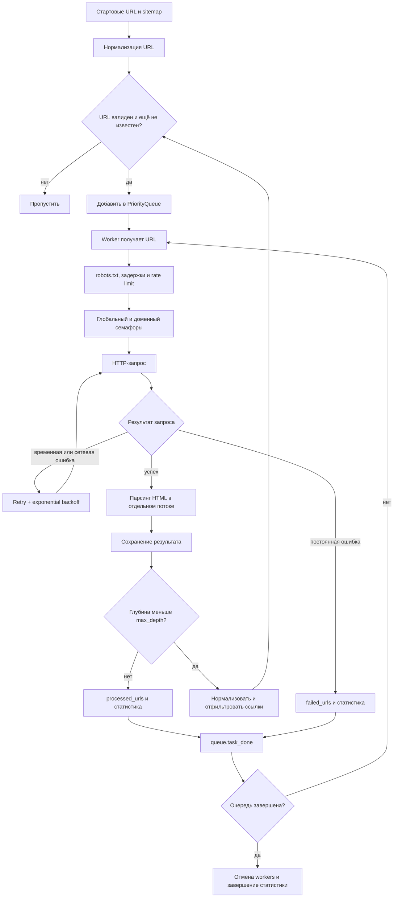

# Алгоритм работы Async Crawler

Этот документ описывает фактический поток выполнения краулера: от получения стартовых URL до сохранения страниц и формирования статистики.

## Основные режимы

У краулера есть три уровня работы:

1. `fetch_url(url)` загружает один URL.
2. `fetch_urls(urls)` параллельно загружает независимый список URL.
3. `crawl(start_urls, ...)` обходит сайт через приоритетную очередь, автоматически добавляя найденные ссылки.

`AdvancedCrawler` — конфигурационная оболочка над `AsyncCrawler`. Он создаёт хранилище, передаёт настройки в основной класс и запускает тот же алгоритм `crawl()`.

Конструкторы обоих классов не требуют активного event loop. `aiohttp.ClientSession` и связанный с ней `RobotsParser` создаются лениво перед первым сетевым запросом. Все запросы используют эту одну сессию и общий connection pool; `AsyncCrawler` также поддерживает `async with`.

## Общая схема обхода



## Загрузка одного URL

`AsyncCrawler.fetch_url()` выполняет следующие действия:

1. Логирует начало загрузки.
2. Вызывает `_wait_before_request()`:
   - при включённом `respect_robots` загружает или получает из кэша правила домена;
   - первая загрузка `/robots.txt` проходит через тот же основной rate limiter;
   - параллельные workers одного домена синхронизируются lock-ом, поэтому `/robots.txt` скачивается один раз;
   - проверяет разрешение для настроенного `User-Agent`;
   - применяет случайный `jitter` в диапазоне от `0` до `min_delay`;
   - ожидает разрешения основного `RateLimiter`;
   - дополнительно соблюдает `Crawl-delay`, если он задан в `robots.txt`.
3. Получает глобальное и доменное разрешения у `SemaphoreManager`.
4. Выполняет `GET` через общую `aiohttp.ClientSession`, поэтому соединения переиспользуются через connection pool.
5. Классифицирует HTTP-статус:
   - `429`, `500`, `503` и остальные `5xx` — `TransientError`;
   - `4xx` — `PermanentError`;
   - таймаут — `TransientError`;
   - ошибка `aiohttp.ClientError` — `NetworkError`.
   Классифицированная HTTP-ошибка логируется с URL, типом исключения и статусом до передачи вызывающему коду.
6. Для успешного ответа читает текст, сохраняет `status_code` и `content_type`, затем возвращает HTML.
7. При временной или сетевой ошибке повторяет весь цикл через `RetryStrategy`.
8. В блоке `finally` каждой попытки всегда освобождает оба семафора.

Таймаут каждой попытки состоит из `total`, `connect` и `sock_read`. Пользовательские значения устанавливаются как таймаут общей `ClientSession`, поэтому действуют и для `robots.txt`/sitemap. Для обычных страниц во время повторов все три значения дополнительно умножаются на номер попытки.

## Параллельная загрузка списка

`fetch_urls()` создаёт coroutine для каждого URL и передаёт их в `asyncio.gather()`.

```python
responses = await asyncio.gather(
    *(crawler.fetch_url(url) for url in urls),
    return_exceptions=True,
)
```

Флаг `return_exceptions=True` делает операцию устойчивой к частичным ошибкам: неудача одного запроса не прерывает остальные запросы и не приводит к падению всего метода. После завершения:

- успешные ответы добавляются в словарь `{url: html}`;
- исключения логируются;
- URL с ошибками не попадают в результирующий словарь.

Фактическое количество одновременно выполняемых HTTP-запросов всё равно ограничивается `SemaphoreManager`, даже если coroutine созданы сразу для всего списка.

`fetch_urls_sequentially()` обрабатывает URL по одному и используется для демонстрации разницы производительности. В отличие от `fetch_urls()`, он не подавляет исключение отдельного запроса.

## Полный обход сайта

### 1. Подготовка

В начале `crawl()`:

- запускается новый `CrawlerStats`;
- создаётся пустой `CrawlerQueue`;
- очищаются результаты предыдущего запуска и счётчики запросов;
- стартовые URL объединяются с URL, полученными из sitemap;
- список разрешённых доменов строится из `start_urls` и `sitemap_urls`, поэтому оба явно настроенных источника учитываются при `same_domain_only=True`;
- каждый URL нормализуется и проходит доменные, include- и exclude-фильтры;
- разрешённый URL получает глубину `0` и добавляется в очередь.

Ошибка загрузки или разбора одного sitemap логируется и даёт пустой список для этого источника. Остальные sitemap и обычные стартовые URL продолжают обрабатываться.

Нормализация выполняется функцией `normalize_url()`:

- относительный адрес преобразуется в абсолютный через `urljoin`;
- удаляется fragment после `#`;
- принимаются только схемы `http` и `https`;
- URL без домена отбрасывается;
- пустой путь заменяется на `/`, поэтому `http://host` и `http://host/` считаются одним URL.

### 2. Workers и очередь

Создаётся до `min(max_concurrent, max_pages)` worker-задач. Каждый worker циклически:

1. получает из `CrawlerQueue` URL с наименьшим значением приоритета;
2. определяет сохранённую глубину URL;
3. загружает страницу через `fetch_url()`, внутри которого работает `RetryStrategy`;
4. парсит HTML;
5. сохраняет результат;
6. добавляет разрешённые ссылки следующего уровня;
7. помечает исходный URL обработанным или неудачным;
8. выводит текущий прогресс.

В очереди хранится `(priority, counter, url)`. Глубина используется как приоритет, поэтому сначала обрабатываются более близкие к стартовой странице URL. Счётчик сохраняет порядок добавления для URL с одинаковым приоритетом.

`queue.join()` завершается только после парного вызова `task_done()` для каждого извлечённого элемента. После этого workers отменяются, а HTTP-сессия остаётся открытой до явного вызова `close()`.

Если в очереди нет URL, публичный `get_next()` сразу возвращает `None`, даже когда другой URL ещё обрабатывается. Workers используют блокирующий `wait_for_next()`: благодаря этому они продолжают ожидать ссылки, которые добавят другие workers, и параллельность обхода не теряется.

### 3. Защита от дубликатов и ограничений

URL добавляется в `visited_urls` до помещения в очередь. Благодаря этому две страницы, одновременно нашедшие одну ссылку, не создают повторную задачу в рамках одного event loop.

Новая ссылка добавляется, только если одновременно выполняются условия:

- достигнутый лимит страниц меньше `max_pages`;
- `next_depth <= max_depth`;
- URL ещё отсутствует в `visited_urls`;
- домен разрешён при `same_domain_only=True`;
- URL не совпадает ни с одним регулярным выражением `exclude_patterns`;
- при непустом `include_patterns` URL совпадает хотя бы с одним выражением.

## Парсинг HTML

`HTMLParser.parse_html()` переносит синхронную работу BeautifulSoup/lxml в `asyncio.to_thread()`, чтобы разбор больших страниц не блокировал event loop.

Из страницы извлекаются:

- `title`, основной `text` и metadata;
- абсолютные уникальные ссылки;
- изображения с `src` и `alt`;
- заголовки `h1`, `h2`, `h3`;
- строки таблиц;
- элементы списков `ul` и `ol`;
- вычисляемые поля `text_length`, `links_count`, `images_count`.

Каждый блок извлекается независимо через `_extract_safely()`. Ошибка одного extractor логируется, а остальные данные возвращаются как частичный результат.

Пустое тело успешного ответа HTTP 200 также передаётся парсеру. Оно считается корректной пустой страницей и возвращает частичный результат с пустыми полями, а не ошибку обхода.

## Повторы и ошибки

`RetryStrategy` встроен в публичный `fetch_url()`. Поэтому автоматические повторы одинаково работают для прямого вызова, `fetch_urls()`, `fetch_and_parse()` и workers внутри `crawl()`; дополнительной внешней retry-обёртки в worker нет.

Для повторяемой ошибки задержка рассчитывается так:

```text
delay = backoff_factor ** attempt
```

Общие `max_retries` и `backoff_factor` можно переопределить через `max_retries_by_type` и `backoff_factors_by_type`. Счётчик повторов ведётся отдельно для каждого фактического типа ошибки. Для HTTP `429` задержка дополнительно умножается на два. Каждый retry-лог содержит URL, тип ошибки, номер попытки и задержку; после восстановления или исчерпания попыток логируется итоговый исход. Затем окончательное исключение возвращается worker-у, URL записывается в `failed_urls`, а обработка очереди продолжается.

| Тип | Примеры | Повтор в `crawl()` |
|---|---|---|
| `TransientError` | timeout, 429, 500, 503 | Да |
| `NetworkError` | DNS, connection refused, ошибки aiohttp | Да |
| `PermanentError` | 401, 403, 404 | Нет |
| `ParseError` | необработанная ошибка разбора HTML | Нет |
| `RobotsBlockedError` | запрет в robots.txt | Нет; URL учитывается отдельным счётчиком и списком в статистике |

## Ограничение нагрузки

Два механизма решают разные задачи:

| Механизм | Что ограничивает |
|---|---|
| `SemaphoreManager` | число одновременно выполняемых HTTP-запросов глобально и для каждого домена |
| `RateLimiter` | минимальный временной интервал между началами запросов |

Основной rate limit создаётся отдельно для доменов. Значение интервала выбирается как максимум из `1 / requests_per_second` и `min_delay`. Правила `Crawl-delay` обслуживаются отдельным limiter для соответствующего домена.

`RobotsParser` хранит отдельные правила и lock для каждого домена. Поэтому один экземпляр безопасно обслуживает несколько доменов, а конкурентные workers не дублируют загрузку одного `/robots.txt`. Ответ `4xx` при загрузке файла трактуется как разрешение обхода, а `5xx` или сетевая ошибка — как запрет обхода.

Sitemap, включая дочерние файлы sitemap index, загружается через тот же callback вежливости: проверку `robots.txt`, jitter, основной rate limit и `Crawl-delay`. После этого из XML извлекаются только прямые `url/loc` или `sitemap/loc`.

## Сохранение

После успешного парсинга worker передаёт хранилищу стандартизированную запись:

```python
{
    "url": str,
    "title": str,
    "text": str,
    "links": list[str],
    "metadata": dict,
    "crawled_at": datetime,
    "status_code": int,
    "content_type": str,
}
```

Доступны следующие реализации `DataStorage`:

- `JSONStorage` — JSON Lines с буфером или форматированный JSON-массив при `formatted=True`;
- `CSVStorage` — CSV с автоматически определяемыми заголовками и настраиваемой кодировкой;
- `PostgreSQLStorage` — batch-вставки через пул `asyncpg`.

Буфер сбрасывается после накопления десяти записей и при `close()`. Ошибка записи повторяется до трёх раз с backoff. Если сохранение страницы окончательно не удалось, worker логирует ошибку и продолжает обход; результат парсинга всё равно остаётся в `processed_urls`. Окончательная ошибка сброса буфера при закрытии также логируется `AsyncCrawler.close()` и не завершает программу исключением.

Файловые результаты и отчёты разрешаются через `GLOBAL_UPLOAD_PATH` и сохраняются внутри `public/uploads/`.

## Состояние и статистика

После обхода доступны:

- `visited_urls` — все принятые к обработке URL;
- `processed_urls` — успешно загруженные и разобранные страницы;
- `failed_urls` — URL и описание окончательных ошибок;
- `get_request_stats()` — текущая скорость запросов, средняя задержка и число блокировок `robots.txt`;
- `get_stats()` — число успешных и неудачных страниц, средняя скорость, HTTP-статусы, топ доменов и время работы.

Общая статистика также содержит количество всех встреченных исключений по типам, список URL с постоянными ошибками и retry-метрики: число повторов, успешное восстановление, исчерпанные повторы и среднюю backoff-задержку.

Статистика экспортируется в JSON и HTML, включая `robots_blocked` и `robots_blocked_urls`. Заблокированная страница входит в `total_pages`, но не смешивается с успешными запросами или ошибками. Все внешние ресурсы освобождаются идемпотентным методом `close()`: если HTTP-сессия была создана, она закрывается, затем сбрасывается буфер и закрывается выбранное хранилище.

В CLI параметр `--output` сохраняет словарь обработанных страниц, возвращённый `crawl()`. HTML-отчёт и программный метод `export_to_json()` экспортируют статистику, включая классификацию ошибок, постоянные ошибки и сведения о повторах.

## Оценка ресурсов

Пусть `N` — число принятых URL, а `E` — общее число извлечённых ссылок.

- проверка дубликатов через `set` занимает в среднем `O(1)` на URL;
- операции приоритетной очереди занимают `O(log N)`;
- фильтрация всех найденных ссылок занимает `O(E)` без учёта стоимости регулярных выражений;
- `visited_urls`, результаты и очередь используют `O(N)` памяти;
- количество активных worker-задач ограничено `max_concurrent`.

В `fetch_urls()` создаётся coroutine для каждого входного URL, поэтому для очень больших заранее известных списков worker-подход из `crawl()` и benchmark потребляет предсказуемее память.
